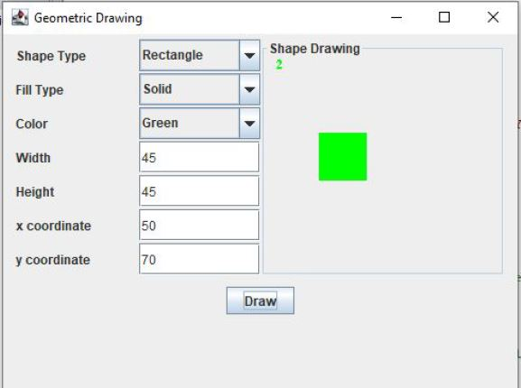

# java-gui-projects
#### Demonstrations of OOP and GUI in Java, using Swing
- `(Java Compiler:  JDK 8.0_265;  JDK:  Amazon Corretto;   IDE: DrJava)`
---
## Project 2: Vehicle Sales Tax calculator

## Project 3: Drawing Shapes GUI

## Project 4: Real Estate Database Manager

